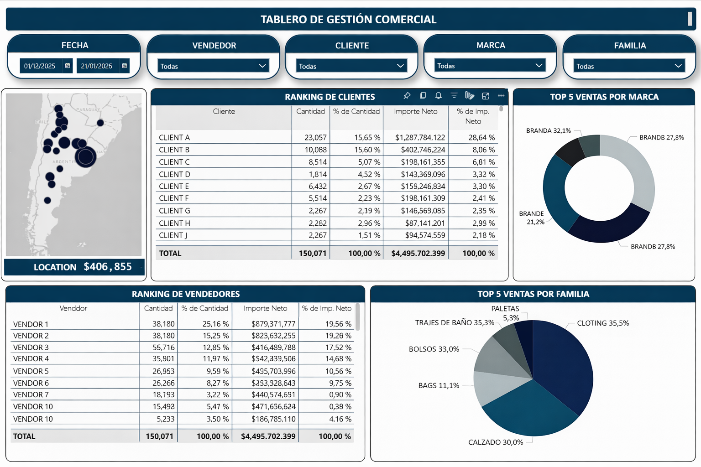

# Sales Management Dashboard (Power BI)
### Commercial Performance Analysis


> Interactive Power BI dashboard for comprehensive commercial performance analysis of a Sports Brands business unit, based on real sales data from 2021 to 2025. Enables analysis of sales by client, salesperson, product, brand and region to support data-driven decision-making for commercial and management teams.

> **Disclaimer:** All datasets, table names, business identifiers and sensitive information have been fully anonymized to preserve confidentiality and comply with corporate data protection policies. This repository is for demonstration purposes only.

---

## Dashboard Preview

Selected screenshot of the interactive Power BI dashboard. All data has been anonymized for confidentiality and demonstration purposes.



---

## Key Findings

Selected insights extracted from the analytical model.

- **High client concentration risk:** the top single client accounts for **28.6% of net revenue** while representing only **15.6% of units sold**, a premium high-ticket account whose loss would significantly impact the P&L. The top 5 clients combined generate approximately **50% of total revenue**, signaling material customer dependency.

- **Distinct buying patterns across top accounts:** Client A and Client B hold a similar share of units (~15.6%) but very different revenue contribution (28.6% vs 8.1%), revealing two clearly differentiated commercial profiles, premium high-margin vs bulk low-ticket, that should be served with different commercial strategies.

- **Sales rep concentration:** the top 3 sales representatives produce **~56% of total revenue**, with significant variance in average ticket size between them. This points to two opportunities: knowledge transfer from top performers and rebalancing of sales territories.

- **Geographic distribution:** sales are concentrated in central Argentina (Buenos Aires and Cordoba regions), with limited penetration in Patagonia, NOA and Cuyo. These regions represent a meaningful expansion opportunity for territory planning.

- **Balanced brand portfolio:** the top 5 brands range between **21% and 32%** participation, indicating a healthy mix without single-brand dependency, a strong base for supplier negotiation.

- **Product family mix:** Clothing and Footwear dominate the category mix, while smaller niche families (bags, paddle gear, swimwear) contribute consistently but at lower volumes, useful for differentiated pricing and promotion strategies.

> *All client, salesperson and brand identifiers have been anonymized. Aggregated percentages are preserved to demonstrate the analytical capability of the model.*

---

## Business Problem & Objective

Commercial teams require consolidated and reliable visibility into sales performance across multiple dimensions in order to:

- Identify top and underperforming clients and sales representatives
- Analyze product, brand and category performance
- Detect geographic trends and regional opportunities
- Support strategic planning and operational decision-making

This dashboard centralizes transactional sales data into a single analytical model, providing a flexible interactive tool that allows business users to explore performance indicators, detect trends and support data-driven decisions.

---

## Architecture & Tech Stack

The analytical workflow follows a standard BI pipeline:

```
SQL Server -> Data Modeling -> Power BI Semantic Model -> Dashboard
```

| Layer | Technology | Purpose |
| --- | --- | --- |
| Source | **SQL Server** | Transactional sales data extraction and dataset construction |
| Modeling | **DAX** | Calculated measures and business logic for advanced analytics |
| Visualization | **Power BI** | Interactive dashboards and KPI monitoring |
| Version Control | **GitHub** | Code, documentation and project history |

---

## Implementation

### Dataset Preparation
Data was extracted from a transactional database hosted on SQL Server. SQL scripts were developed to build the base dataset used as the data source for analysis and visualization in Power BI.

- SQL extraction scripts: [`sql/`](sql/)

### DAX Measures & Business Logic
DAX measures were implemented to calculate key performance indicators and commercial performance metrics, including:

- Sales totals and year-over-year variations
- Client and salesperson rankings
- Contribution and participation percentages
- Time intelligence calculations across multiple years (2021-2025)

DAX measures: [`dax/`](dax/)

---

## Key Features

- Interactive dashboards with dynamic filters and slicers
- Client and salesperson ranking analysis
- Brand, product family and category performance views
- Geographic sales distribution and regional performance analysis
- Time-based analysis across multiple years (2021-2025)
- KPI monitoring for commercial performance

---

## Roadmap (Optional Improvements)

- Add incremental refresh for large historical datasets
- Implement Row-Level Security (RLS) for role-based access
- Extend the model with profitability and margin analysis
- Integrate automated refresh and monitoring workflows
